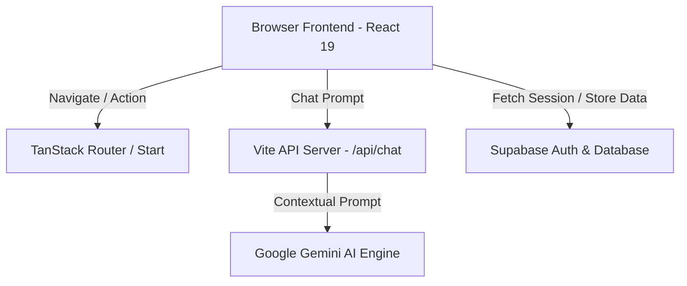

# 🌍 EcoTrack2AI: AI-Powered Sustainability Intelligence Platform

EcoTrack2AI is an enterprise-grade, full-stack sustainability platform designed to help users measure, analyze, and systematically reduce their carbon footprint. By combining multi-category carbon calculator logic, interactive data visualizations, and real-time AI coaching powered by Google Gemini, the platform turns environmental awareness into structured, daily habits.

🌐 **Live Demo Website**: [ecotrack2ai.lovable.app](https://ecotrack2ai.lovable.app)

---

## 📌 Table of Contents
1. [Project Overview](#-project-overview)
2. [Problem Statement](#-problem-statement)
3. [Core Features](#-core-features)
4. [Architecture Overview](#-architecture-overview)
5. [Folder Structure](#-folder-structure)
6. [Tech Stack](#-tech-stack)
7. [Installation & Setup](#-installation--setup)
8. [Environment Variables](#-environment-variables)
9. [Testing Instructions](#-testing-instructions)
10. [Deployment Guide](#-deployment-guide)
11. [Security Considerations](#-security-considerations)
12. [Future Improvements](#-future-improvements)

---

## 🌍 Project Overview

EcoTrack2AI provides individuals and organizations with data-driven sustainability metrics. The system leverages standard greenhouse gas emission factors to evaluate user habits, aggregates these into analytical dashboard charts, generates downloadable impact summaries, and provisions an on-demand AI Coach trained on climate science to answer questions and draft customized emission reduction schedules.

---

## 📌 Problem Statement

Living sustainably requires understanding how everyday choices—commuting, diet, heating, and purchasing habits—contribute to global warming. However, typical consumers face several challenges:
* **Information Fragmentation**: Emission factors and climate actions are scattered across research papers and generic websites.
* **Lack of Personalization**: Standard carbon calculators produce a number but fail to provide tailored, context-aware steps for improvement.
* **No Feedback Loops**: Users calculate their footprint once but lack dashboard tracking, historical archives, or continuous engagement mechanisms.

EcoTrack2AI solves this by combining interactive assessment, historical dashboards, automated monthly reports, and an AI chat assistant with access to the user's latest footprint data.

---

## ✨ Core Features

### 1. Carbon Footprint Assessment
A multi-category questionnaire analyzing habits across:
* **Transportation**: Daily driving distances and public transit usage.
* **Travel**: Short-haul and long-haul annual flight frequencies.
* **Energy**: Monthly electricity consumption and renewable tariff offsets.
* **Food & Diet**: Diet types (vegan, vegetarian, heavy-meat) and local food sourcing rates.
* **Waste & Composting**: Recycling ratios and organic composting habits.
* **Shopping**: Buying frequency and fast fashion choices.

### 2. Analytics Dashboard
Interactive visualizations powered by Recharts, providing:
* **Carbon Score**: A normalized score (0-100) indicating environmental performance.
* **Rating Badges**: Tiers ranging from *Getting Started* (Tier 1) to *Eco Champion* (Tier 5).
* **Category Breakdown**: Proportional charts detailing which categories represent the highest impact.
* **Historical Tracking**: Trend lines illustrating score progression over multiple assessments.

### 3. AI Sustainability Assistant
An interactive chat interface powered by Google Gemini AI via the Vercel AI SDK:
* **Contextual Awareness**: The AI is pre-seeded with the user's latest footprint assessment data to give precise, contextual recommendations.
* **Science-Backed Advice**: Trained to explain complex carbon calculations and propose practical eco-friendly alternatives.
* **Autoscrolling Messages**: Clean, modern chat container with autoscrolling layout and loading indicators.

### 4. Monthly Impact Reports
On-demand report compiler that allows users to:
* Summarize their annual footprint in tonnes of $CO_2e$.
* Compare their footprint against the global average (4.7 tonnes).
* Generate recommended actions (e.g., swapping vehicle trips, composting).
* Download reports as plain-text files and automatically log compilation history to the Supabase database.

### 5. Secure Authentication & Protected Routes
* User registration, login, session persistence, and secure routing powered by Supabase Authentication.
* User data (assessments, reports, profile preferences) is completely isolated and insulated.

---

## 🏗️ Architecture Overview

EcoTrack2AI is built on a modern, decoupled client-server architecture:



### Key Architectural Patterns
* **Full-Stack Boundaries**: Powered by TanStack Start and Vinxi, bridging server functions and client-side React code with type-safe routing.
* **Database & Row-Level Security (RLS)**: Interacts with Supabase PostgreSQL tables (`profiles`, `assessments`, `reports`). Access is secured by Row Level Security (RLS) to ensure users can only read/write their own records.
* **Environment Independence**: Mocks all third-party integrations (Supabase, Lovable SDK, Recharts, DOM APIs) during Vitest runs to enable fast, offline, and reliable CI checks.

---

## 📂 Folder Structure

```bash
├── .github/                  # CI/CD Workflows
├── .lovable/                 # Lovable project metadata
├── supabase/                 # Supabase migration scripts and config
├── src/
│   ├── components/
│   │   ├── ui/               # Reusable primitive components (Shadcn)
│   │   ├── site-nav.tsx      # Main layout headers and footers
│   │   └── theme-toggle.tsx  # Theme provider integration UI
│   ├── hooks/
│   │   └── use-auth.tsx      # Session management and profile hook
│   ├── integrations/
│   │   ├── lovable/          # OAuth helper client
│   │   └── supabase/         # Supabase client initialize & typings
│   ├── lib/
│   │   ├── assessment.ts     # Core carbon calculation math and JSDocs
│   │   └── badge.ts          # Tier calculations
│   ├── routes/
│   │   ├── __root.tsx        # Base template (contains navigation & root layout)
│   │   ├── auth.tsx          # Login & registration forms
│   │   ├── api/
│   │   │   └── chat.ts       # Backend API proxy for Gemini AI SDK
│   │   └── _authenticated/   # Protected routes (Dashboard, Assessment, Coach, Reports)
│   │       ├── assessment.tsx
│   │       ├── assistant.tsx
│   │       ├── dashboard.tsx
│   │       ├── guide.tsx
│   │       ├── profile.tsx
│   │       └── report.tsx
│   ├── styles.css            # Tailwind variables and CSS adjustments
│   ├── main.tsx
│   └── routeTree.gen.ts      # Automated route manifest (TanStack Router)
├── vitest.config.ts          # Vitest testing environment config
├── vitest.setup.ts           # Global mocks and stubs for DOM environment
├── package.json
└── tsconfig.json
```

---

## 🛠️ Tech Stack

* **Frontend Library**: React 19 (Concurrent features, rendering optimizations)
* **Framework**: TanStack Start / Vinxi (Full-stack SSR React framework)
* **Routing**: TanStack Router (Fully type-safe client-side routing)
* **Styling**: Tailwind CSS v4, Lucide React (Icons), Radix UI (Primitives)
* **Database & Session**: Supabase JS SDK (PostgreSQL database, authentication)
* **AI Framework**: Vercel AI SDK (`ai` & `@ai-sdk/react`), Google Gemini 1.5 Flash API
* **Build Tooling**: Vite v8, TypeScript v5.8, LightningCSS (CSS compilation)
* **Testing Setup**: Vitest v3, React Testing Library, JSDOM
* **Code Formatting**: ESLint v9, Prettier v3

---

## ⚙️ Installation & Setup

### Prerequisites
* **Node.js**: `v20.x` or later (Long Term Support recommended)
* **npm** or **Bun**

### Step-by-Step Installation

1. **Clone the Repository**:
   ```bash
   git clone https://github.com/AnjaliSathavara/ecotrack2ai.git
   cd ecotrack2ai
   ```

2. **Install Dependencies**:
   ```bash
   npm install
   ```

3. **Configure Environment Variables**:
   Create a `.env` file in the root directory (see [Environment Variables](#-environment-variables) section below).

4. **Launch the Development Server**:
   ```bash
   npm run dev
   ```
   Open `http://localhost:8080` in your browser.

---

## 🔑 Environment Variables

The application requires connection details for Supabase (for database/auth) and Google Gemini (for the AI Coach). Set these variables in a `.env` file in your root folder:

```env
# Supabase Configuration
VITE_SUPABASE_URL=https://your-supabase-project.supabase.co
VITE_SUPABASE_ANON_KEY=eyJhbGciOiJIUzI1NiIsInR5cCI6IkpXVCJ9...

# AI Configuration (Gemini API Access)
GEMINI_API_KEY=AIzaSy...
```

*Note: Environment variables prefixed with `VITE_` are exposed to the client, while others (like `GEMINI_API_KEY`) remain strictly on the server.*

---

## 🧪 Testing Instructions

We maintain a 100% passing test suite covering calculation functions, auth flows, form validation, and component rendering.

### Run All Test Suites
```bash
npm run test
```

### Launch Tests in Interactive Watch Mode
```bash
npm run test:watch
```

### Generate Code Coverage Reports
```bash
npm run test:coverage
```

### Testing Principles Used
* **Hoisted Mocks**: Variable-based mock stubs use `vi.hoisted` to ensure they are initialized before Vitest hoists `vi.mock` declarations.
* **Component Testing**: Uses React Testing Library to simulate user interactions (typing, clicking tabs, forms submission).
* **DOM Polyfills**: Mocks non-implemented browser APIs in JSDOM, such as `Element.prototype.scrollTo` and `ResizeObserver`.

---

## 🚀 Deployment Guide

### Production Build
Compile and bundle the client-side files and server-side SSR handlers:
```bash
npm run build
```

This generates:
* `dist/client`: Optimized, minified frontend assets.
* `dist/server`: Node/Server handlers for Server-Side Rendering (SSR) and API routes.

### Preview Local Build
```bash
npm run preview
```

### Hosting Recommendations
* **Lovable**: Built-in support for instant cloud hosting.
* **Vercel / Netlify**: Fully compatible via standard adapters.
* **Cloudflare Workers / Pages**: TanStack Start compiles with Nitro, making it highly optimized for Cloudflare Module deployment.

---

## 🔒 Security Considerations

* **Row Level Security (RLS)**: Supabase PostgreSQL tables utilize RLS policies. Users can only write data where `user_id` matches their own token payload (`auth.uid()`).
* **Server-Only API Keys**: The `GEMINI_API_KEY` is kept strictly on the server side (processed in `src/routes/api/chat.ts`). No API keys are leaked to the client browser.
* **Input Sanitization**: Carbon assessment inputs are bound to sliders, select dropdowns, and strict Zod validation schemas (`emailSchema` and `passwordSchema` in `/auth` page) to prevent invalid values.
* **Password Hashing**: Authentication is managed by Supabase, leveraging bcrypt hashing and JSON Web Tokens (JWT) for secure session checks.

---

## 🔮 Future Improvements

* **PDF Export Support**: Allow users to download visual PDF reports containing charts, rather than standard plain text.
* **Smart Home Integrations**: Sync with smart meters (electricity) or driving apps (mileage) to automate carbon footprints.
* **Community Challenges**: Add social leaderboards, sustainability streaks, and eco-challenges.
* **Carbon Offsetting**: Direct integrations with verified reforestation or renewable projects for carbon offset purchases.

---

## 👩‍💻 Developed By

* **Anjali Sathavara** — AI-Powered Sustainability Project Developer
* Developed for educational, innovation, and sustainability purposes.

---

## 📜 License

This project is licensed under the MIT License - see the LICENSE details for info.
